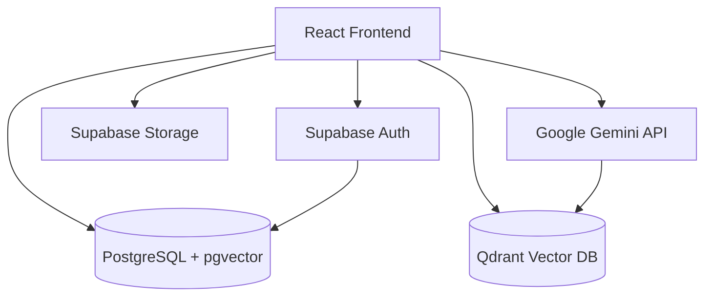
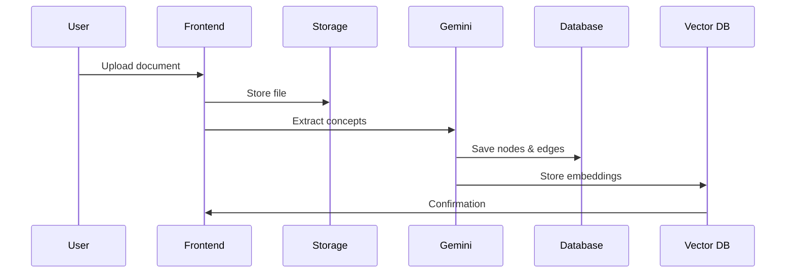
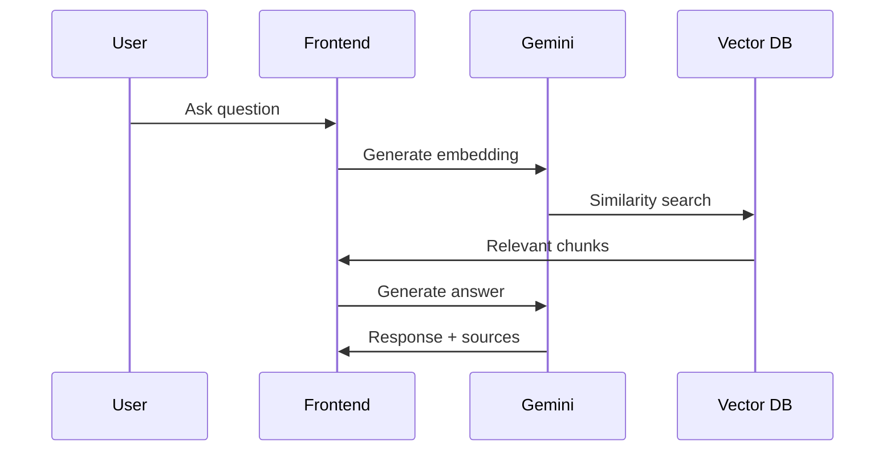

# System Architecture

## Overview

Second Brain AI is a modern, enterprise-grade knowledge management system built with a microservices-inspired architecture using serverless technologies.

## Architecture Diagram



## Frontend Architecture

### Technology Stack
- **React 18** - UI framework
- **TypeScript** - Type safety
- **Vite** - Build tool
- **TailwindCSS** - Styling
- **Framer Motion** - Animations
- **React Query** - Server state management
- **Zustand** - Client state management

### Folder Structure
```
src/
├── components/     # Reusable UI components
├── pages/          # Page components
├── hooks/          # Custom React hooks
├── lib/            # Third-party integrations
├── types/          # TypeScript definitions
├── utils/          # Helper functions
└── App.tsx         # Main application
```

## Backend Architecture

### Supabase (Database & Auth)
- **PostgreSQL** - Primary database
- **pgvector** - Vector embeddings storage
- **Row Level Security** - User data isolation
- **Real-time subscriptions** - Live updates
- **Authentication** - Email, OAuth (Google)
- **Storage** - Document file storage

### Database Schema

#### Tables
1. **profiles** - User profiles
2. **documents** - Uploaded documents
3. **nodes** - Knowledge graph nodes
4. **edges** - Knowledge graph relationships
5. **document_chunks** - Text chunks with embeddings
6. **chat_messages** - Chat history

### AI Pipeline

#### Document Processing Flow


#### Chat Flow (RAG)


## Data Flow

### Authentication
1. User signs in via Supabase Auth
2. JWT token stored in localStorage
3. Token included in all API requests
4. RLS policies enforce data access

### Document Upload
1. File uploaded to Supabase Storage
2. Metadata saved to `documents` table
3. Content extracted and chunked
4. Gemini generates embeddings
5. Chunks stored with embeddings
6. Concepts extracted → nodes/edges created

### Knowledge Graph
1. Nodes represent entities (documents, concepts, people)
2. Edges represent relationships
3. 3D visualization using force-directed layout
4. Real-time updates via Supabase subscriptions

## Security

### Authentication & Authorization
- JWT-based authentication
- Row Level Security (RLS) on all tables
- User-scoped data access
- OAuth integration (Google)

### Data Protection
- Encryption at rest (AES-256)
- TLS 1.3 in transit
- Environment variables for secrets
- CORS configuration

### Input Validation
- Client-side validation
- Server-side validation (RLS)
- File type/size restrictions
- XSS prevention

## Performance Optimization

### Frontend
- Code splitting (React.lazy)
- Image optimization
- Debounced search
- Virtual scrolling for large lists
- Memoization (useMemo, useCallback)

### Backend
- Database indexes on foreign keys
- Vector similarity index (ivfflat)
- Connection pooling
- CDN for static assets

### 3D Graph
- WebGL rendering
- Level-of-detail (LOD) optimization
- Frustum culling
- Lazy loading for large graphs

## Deployment

### Frontend (Cloudflare Pages)
- Automatic builds from Git
- Global CDN distribution
- Unlimited bandwidth
- Custom domain support

### Backend (Supabase)
- Managed PostgreSQL
- Auto-scaling
- Automatic backups
- 99.9% uptime SLA

### Vector DB (Fly.io)
- Self-hosted Qdrant
- 3 free VMs
- Global deployment
- Persistent volumes

## Monitoring & Analytics

### Error Tracking
- Console error logging
- Supabase error logs
- User feedback system

### Performance Metrics
- Page load time
- Time to interactive
- API response times
- 3D graph FPS

## Future Enhancements

1. **Collaborative Features** - Real-time multi-user editing
2. **Advanced AI** - Custom fine-tuned models
3. **Mobile Apps** - React Native iOS/Android
4. **API** - Public REST API
5. **Plugins** - Extension system
6. **Export** - PDF, Markdown, JSON exports
7. **Integrations** - Notion, Obsidian, Roam

---

**Last Updated**: January 2026
